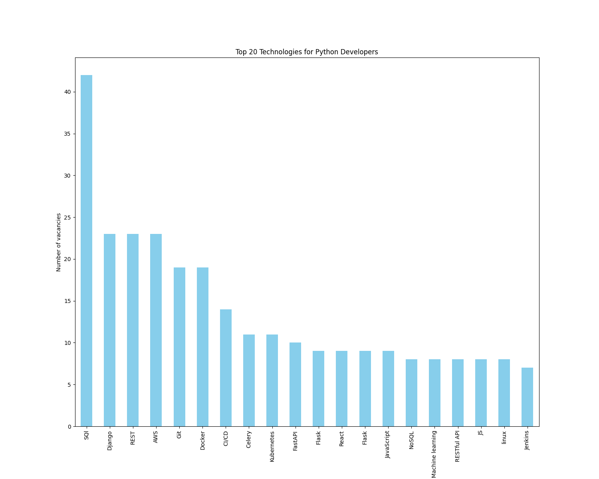

# Data Analysis and Web Scraping project

This project aims to provide insights into the most in-demand technologies in the job market for Python developers in Ukraine.

By scraping job listings from the Djinni job search platform, the project gauges the frequency with which various technologies are mentioned in the job descriptions, affording developers an informed view of the current tech landscape.

## Installing

1. **Execute the following commands:**
   ```bash
   git clone https://github.com/obohatov/data-analysis-and-scraping-project
   cd data-analysis-and-scraping-project
   python -m venv venv
   source venv/bin/activate # or venv\Scripts\activate in Windows
   pip install -r requirements.txt
   ```
   
2. **Run main.py to scrape the data, clean it and generate visualizations.**
3. **Find the latest result in the `visualisation` folder.**

You have the opportunity to configure a list of current technologies for Python developers in the config.py in the folder scrapping.

## Diagram of the 20 most popular technologies for Python developers


## Wordcloud
As an additional way to visualize the popularity of Python-related technologies among Ukrainian employers, we use Wordcloud.


## Correlation
Utilizing additional data collected during the scraping process, we made a decision to examine the correlation (a measure of the strength and direction of a linear relationship between two variables, with values ranging from -1 to 1.) between certain characteristics of job vacancies for Python developers in Ukraine.


At the time of this project's inception, a relatively high positive correlation was observed among job vacancy attributes between the required work experience of the developer and the salary offered to them.

Simultaneously, a considerably weaker but nonetheless negative correlation was observed between the number of applications for a specific vacancy and both work experience and future salary.
